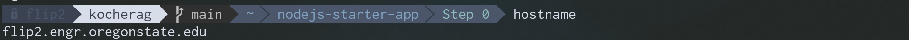
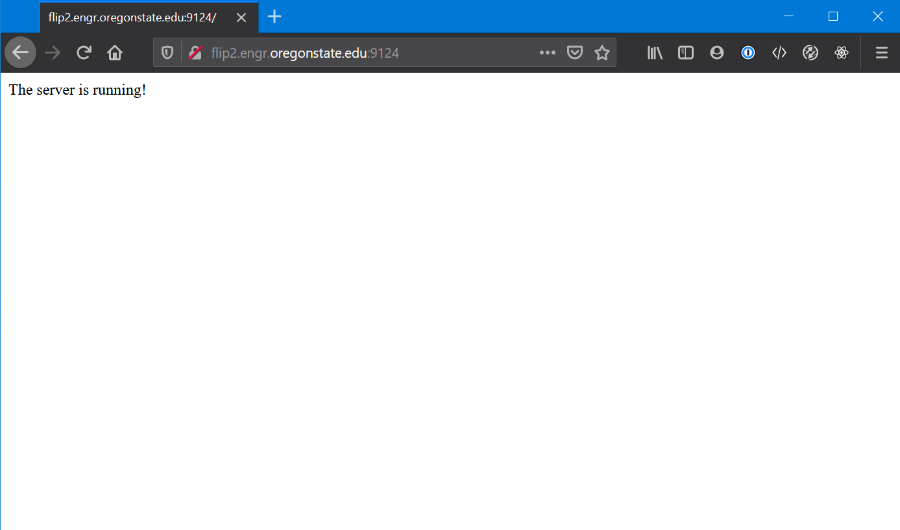
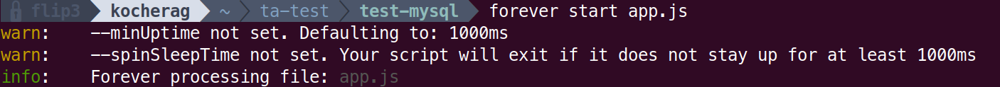

# Node.js - Step 0 - Getting a Server Running
This is the bare minimum you need to get running with Node.js. This will get you a server that can accept web requests and will return an output.

## Initialize your Project

Starting in your empty folder where you will begin building your project run the following command in your terminal:

```bash
npm init
```

This will create the `package.json` file that allows you to easily keep your imported libraries for the project up-to-date as well as share your project with other people (and later deploy your project) without constantly sharing the eggregiously large `/node_modules` folder.

Running this command will ask you a series of questions. For most of them you can simply hit enter. There are two important ones however:

1. Entry Point - You must set this to `app.js`. It will suggest `index.js` as a default.

2. Author - Enter your name, take credit for your hard work.

## Install Express

Ok, now we have to install express, since, that is what we will be using as a server engine. Don't read too much into this step at first. We will talk more about it in later steps. From the prompt, in the root of your project, run:

```bash
npm i express --save
```

`i` just means install. `--save` will make sure the fact we installed this dependency gets added to our `package.json`. If you don't want to be constantly uploading, downloading, zipping and sending giant `node_modules` folders in your project, then you need to make sure you always install new packages with the `--save` option.

## Install `forever`

We need to install the forever code, so the first command you have to run is going to be 
```bash
npm i forever --save
```
In short, if you were to run the command `node app.js` right now from the root of your project, you would be able to access it, via your browser. It would continue to work... until you logged out of the SSH session. We want this project to run forever (pardon the pun), so that it stays up until we want it to come down.

For reasons beyond your control, running `forever` is a bit more complex on the school's FLIP server. Here is how to make it easy, run the following command from the root of your project:

```bash
alias forever='./node_modules/forever/bin/forever'
```

Now, whenever you run `forever` from the *root* of any project that has the forever dependency installed, it will work, without fail. If you want to make this more permanent (not absolutely permanent), you can add this as a line towards the end of the `~/.bashrc` file in your home directory (notice the ~ squiggly) on the OSU FLIP server.

> You must run the forever command from the root of your project (where app.js is located). If you don't it will fail.

## App.js

You will need to create an `app.js` in the root of your project folder. Create a new file, and save it as `app.js` 

Our `app.js` is broken into three pieces at the very start. We have our SETUP, ROUTES, and LISTENER sections.

The SETUP neatly contains all of the variables we will need to effectively run the server and handle data. We will add things to
this part of the project regularly.

The ROUTES section contains every single path the server will respond to. Imagine the server is running on `flip1.engr.oregonstate.edu:9123`,
I could open my browser while connected to the OSU VPN, and navigate to `http://flip1.engr.oregonstate.edu:9123/` and get the desired output.
The ROUTES section define the path after the host name such as `flip1.engr.oregonstate.edu:9123`. `'/'` is considered the **root** route.

The LISTENER section is what actually makes the server *work*. Without this, the server won't, well, listen. We need to make sure it is given the PORT we want it to listen on. 

```javascript
// App.js

/*
    SETUP
*/
var express = require('express');   // We are using the express library for the web server
var app     = express();            // We need to instantiate an express object to interact with the server in our code
PORT        = 9124;                 // Set a port number at the top so it's easy to change in the future

/*
    ROUTES
*/
app.get('/', function(req, res)                 // This is the basic syntax for what is called a 'route'
    {
        res.send("The server is running!")      // This function literally sends the string "The server is running!" to the computer
    });                                         // requesting the web site.

/*
    LISTENER
*/
app.listen(PORT, function(){            // This is the basic syntax for what is called the 'listener' which receives incoming requests on the specified PORT.
    console.log('Express started on http://localhost:' + PORT + '; press Ctrl-C to terminate.')
});
```

# Running Step 0

Once you have completed the above three steps, navigate to the root of your project in your terminal, and run the command `node app.js`. You should see the following output in the terminal:


We can now open a browser.

If you are following along on a flip, type `hostname` in at the prompt and it will tell you what server you are currently developing your project on.



Navigate to `http://flipX.engr.oregonstate.edu:port`. Replace `X` with the flip number we got from `hostname`. In our case, we replace `X` with `2`. Replace `port` with the value you set `PORT` to in `app.js`. In our case it's `9124`.

Otherwise, if you are following along on your computer locally, just navigate to `http://localhost:port` setting port the same way as stated in the previous paragraph.

The end result will be a string of text in the browser saying "The server is running!":



# Running Step 0 with `forever`

Before you wrap up your assignment, you want to make sure it stays up even after you log off. Stop `node`, then, from the root of your project, run the command `forever start app.js`. You
should then see a few lines of text indicating that your `app.js` is being processed like this:



You can verify that your project will run forever (pun sort-of intended), by closing out of your terminal now. Ensure you are still connected to the OSU VPN and navigate to your web application again. If it loads, `forever` is working.

This guidance on implementing `forever` can be used on any Node.JS project, and can be used in any step outlined in this walkthrough.