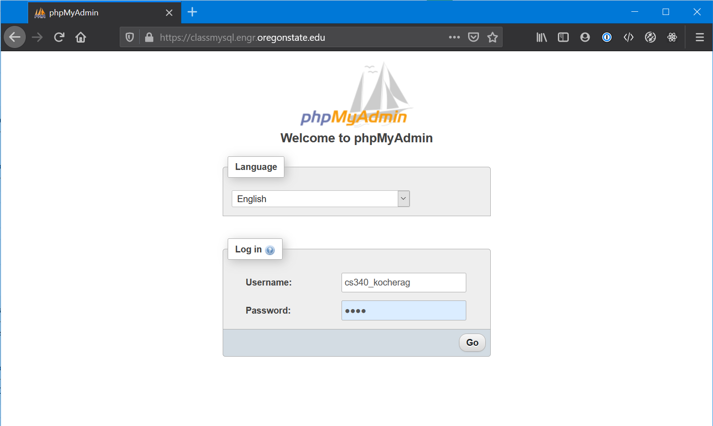
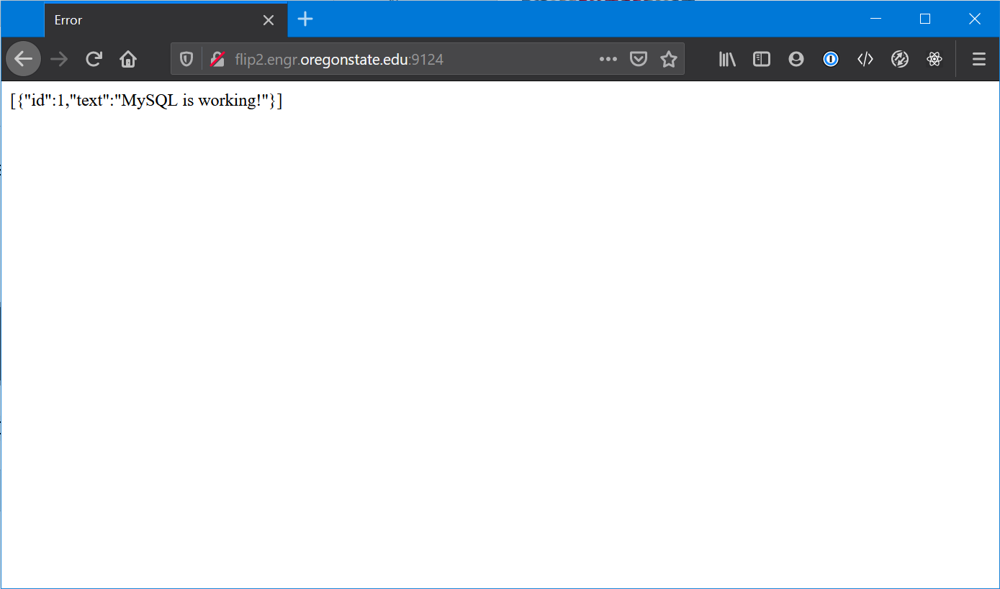

# Node.js - Step 1 - Connecting to a MySQL Database
Once we are able to observe the server is running, we then need to connect our database.

# Validate That Your Database Exists

I know, crazy thing, but it wouldn't be fun to do all the hard work to find out there was actually an issue with your database, like not existing. Happens though. If you run into an issue here, you'll have to reach out to the EECS Help Desk and put in a ticket so they can fix it.

|:exclamation: REMEMBER|
|:--------------|
|Your ONID and database username are NOT the same! Also, your Password is also different than your OSU login password! It's usually the last four of your ID number.|

## Method 1 - Command Line Interface

While ssh'd into a flip, enter the following command:

```bash
mysql -u [your_database_username] -p -h classmysql.engr.oregonstate.edu

# replace [your_database_username] with your db username, usually cs340_[your_onid]

# You'll be prompted for your password, enter it.
```

Assuming all goes well, you'll similar output like this:


> The image above looks a little weird becuase of how I have SSH configured. The command wraps back onto itself, instead of dropping to a new line. The end result is the same though.

If you run the command `show databases;` in the MySQL client, you should see a database named in a similar fashion listed in the output. For me its `cs340_kocherag`, for you, it should be `cs340_` + your ONID.

## Method 2 - PHPMyAdmin

Open a web browser. Make sure you are connected to the OSU VPN.

Navigate to `https://classmysql.engr.oregonstate.edu`. You will be presented with a login screen.



Enter your correct database credentials here and click `Go`. You will be at your database home screen.


You should see a tree on the left hand part of the screen with all your databases. In particular, the one we definitely need to see is the one that says `cs340_` followed by your ONID. If we see that, we are all set.

# Connect your `app.js` to your Databse

There is a bit of 'set-up' that has to happen here but consider it more like building a foundation before you start building the house.

## Install the `mysql` package

From the root of your project run the following command in your terminal:

```bash
npm i mysql --save
```

## Create the `database` folder and `db-connector.js`

From the root of our project, create a folder called `database`. We want to stay organized, this is a step in that direction. Next, create a file in that folder called `db-connector.js`. Open it up:

```javascript
// ./database/db-connector.js

// Get an instance of mysql we can use in the app
var mysql = require('mysql')

// Create a 'connection pool' using the provided credentials
var pool = mysql.createPool({
    connectionLimit : 10,
    host            : 'classmysql.engr.oregonstate.edu',
    user            : 'cs340_[your_onid]',
    password        : '[your_db_password]',
    database        : 'cs340_[your_onid]'
})

// Export it for use in our applicaiton
module.exports.pool = pool;
```

## Update your `app.js`

Open up your `app.js` and we need to make a few additions now. Remember we split the file up into three pieces, SETUP, ROUTES and LISTENER... we need to add the following to SETUP.

```javascript
// app.js

// Database
var db = require('./database/db-connector')
```

We then need to modify the root route, that is the route which has the string `'/'` as its target:

```javascript
// app.js 

app.get('/', function(req, res)
    {
        // Define our queries
        query1 = 'DROP TABLE IF EXISTS diagnostic;';
        query2 = 'CREATE TABLE diagnostic(id INT PRIMARY KEY AUTO_INCREMENT, text VARCHAR(255) NOT NULL);';
        query3 = 'INSERT INTO diagnostic (text) VALUES ("MySQL is working!")';
        query4 = 'SELECT * FROM diagnostic;';

        // Execute every query in an asynchronous manner, we want each query to finish before the next one starts

        // DROP TABLE...
        db.pool.query(query1, function (err, results, fields){

            // CREATE TABLE...
            db.pool.query(query2, function(err, results, fields){

                // INSERT INTO...
                db.pool.query(query3, function(err, results, fields){

                    // SELECT *...
                    db.pool.query(query4, function(err, results, fields){

                        // Send the results to the browser
                        let base = "<h1>MySQL Results:</h1>"
                        res.send(base + JSON.stringify(results));
                    });
                });
            });
        });
    });
```

There is a lot going on here, admittedly.

The most straightforward way of getting queries we want to execute is to write each query out as a string. We give each one a name. Now, keep in mind, with Javascript, if we aren't careful, it will try to execute every line of code as fast as it conceivably can, even if the previous function did not return yet. We need to **make** it wait. This is accomplished by nesting each `query()` call. The next one will not start to run, until the previous one finishes.

> If you notice, every `db.pool.query()` call takes two arguments. The first is the query we want to run, and the second is what is called a **callback** function. This is the function that will run after the current function is done executing.

Remember we assigned the whole database configuration in `db-connector.js` to `module.exports.pool`, and then we specified in `app.js` that `db = require('./database/db-connector')`. So we export an object containing an object with a key `pool`, and in `app.js` assign that object to `db`. This is why we have to run queries by first typing `db.pool.*`. You might be asking, and you should know why!

Lastly, we need to perform `JSON.stringify(results)` before sending the data back to the client browser. Try sending the results back without doing this, note the difference, not what we want.

Once you try out `JSON.stringify(results)` to see the result, replace it with the these two lines of code:

`let base = "<h1>MySQL Results:</h1>"` <br />
`res.send(base + JSON.stringify(results));`

Assuming you got all of that, we should be able to restart our server, and get the following results:




