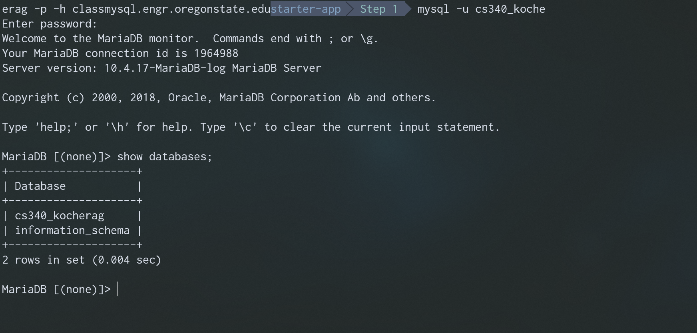

# Node.js - Step 0 - Connecting to the Database
Once we are able to observe the server is running, we then need to connect our database.

# Validate That Your Database Exists

I know, crazy thing, but it wouldn't be fun to do all the hard work to find out there was actually an issue with your database, like not existing. Happens though. If you run into an issue here, you'll have to reach out to the EECS Help Desk and put in a ticket so they can fix it.

## Method 1 - Command Line Interface

While ssh'd into a flip, enter the following command:

```bash
mysql -u [your_database_username] -p -h classmysql.engr.oregonstate.edu

# replace [your_database_username] with your db username, usually cs340_[your_onid]

## 
```

|:exclamation: REMEMBER|
|:--------------|
|Your ONID and database username are NOT the same! Also, your Password is also different than your OSU login password! It's usually the last four of your ID number.|


Assuming all goes well, you'll similar output like this:




