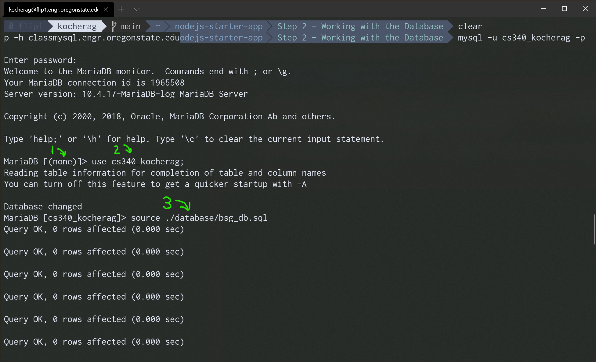
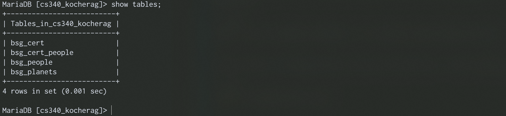
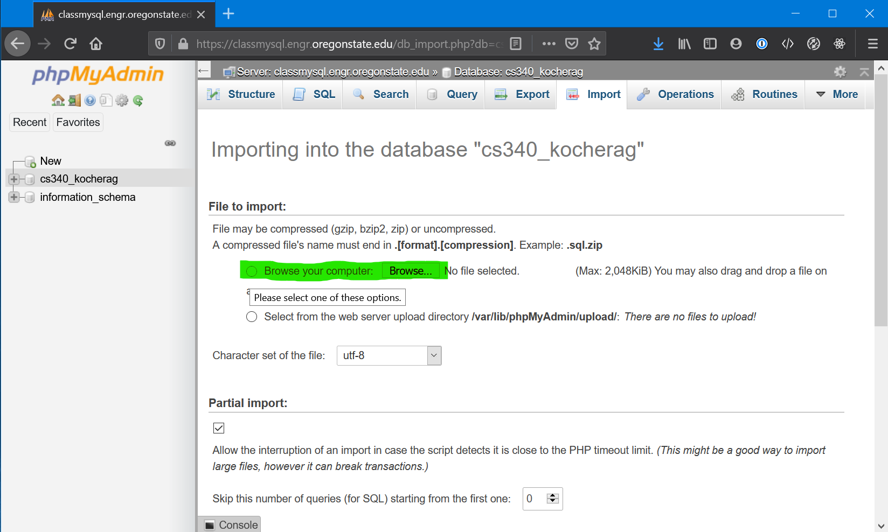

# Node.js - Step 2 - Working with the Database

At this point, we have a basically functional full-stack web application. Sure it only runs a single query and just prints it on the screen. But it has a front-end (what the user sees), and back-end (Node.js with Express) along with persistent data storage (MySQL).

We can definitely do more with this, and we will, now.

# Filling the Database with New Data

In this part, in the `database` folder, you will find an SQL file called `bsg_db.sql`. We want to use that file to "load" our database. If you open it up and look at it, its just plain old SQL with a lot of metadata that `mysqldump` generates. It's nothing fancy. Scroll through it and look, there are INSERT and CREATE statements just as if you were adding data line-by-line.

By far the easiest way to add data to the database from an SQL file is using the terminal. It's the easiest because you may not always have a graphical user interface to manipulate your database like phpMyAdmin. I'll show you both ways

## CLI - Command Line Interface

Starting from the root directory of your project, go ahead and login to the mysql CLI. If you missed it, we covered this more in-depth in Step 1. The command looks like this:

```bash
mysql -u [your-database-username] -p -h classmysql.engr.oregonstate.edu
```

You will then be presented with a few lines of text and a cursor blinking. You then want to enter the following SQL command to load `bsg_db.sql` into the database.

Once you are in the MySQL CLI, you need to tell MySQL which database we want to use. OSU only gives you one, and it's name is usually in the format `[classNumber]_[ONID]`, so for me, I will run the command:

```sql
USE cs340_kocherag;
```

At this point, we can load the database with our file by typing:

```sql
source ./database/bsg_db.sql;
```

Once you hit enter, assuming you followed these instructions correctly, you should see a variety of queries saying they were OK. Eventually, the output stops and you are at a cursor again:



> 1. The school's database interface will tell you the current database you are 'using'. Make sure that before you perform any operation such as loading a database, you 'use' it first.
> 2. You can see we `use cs340_kocherag;` so that when we import the SQL file, this is the database that gets loaded.
> 3. Once we are using the correct database, we can then run our `source` command to load the SQL file.

If you want to validate the tables were actually created, you can run the following command from within the MySQL CLI:

```sql
SHOW TABLES;
```

You should see some output that looks like this if you correctly loaded `bsg_db.sql`:



## Loading Data with phpMyAdmin

First step is to make sure you are connected to the OSU VPN, and then open your favorite browser, and navigate to `https://classmysql.engr.oregonstate.edu/`, login.


When you first login, you will be at the home screen. At the top, you will see a bunch of tabs, we want the 'Import' tab, pointed to by the red arrow, click it.



On this screen, assuming you know where the SQL file you want to load is on your computer, click "Browse your computer" (highlighted in green) and then click "Browse". Select the SQL file on your computer that you want to load in to the database. Then scroll down to the bottom of the page and click 'Go'.

Assuming all went well, you will get a screen telling you that "Import has been successfully finished."


Testaklsjdf;lkasjdfl;kja
aksljdf
