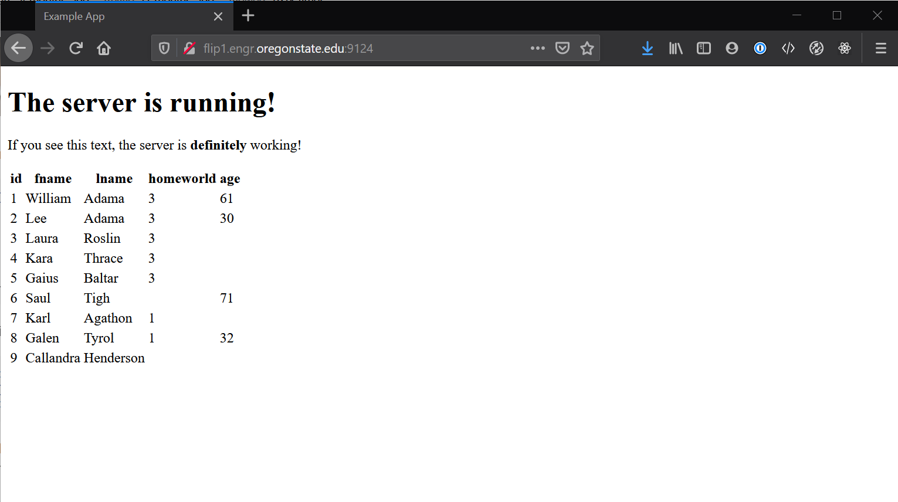

# Node.js - Step 4 - Dynamically Displaying Data

This is the bread-and-butter section where Node.js really begins to shine. We are going to get data from a MySQL query and present it in a meaningful manner on the browser.

> This is a good point to make sure you have imported the contents of `bsg_db.sql` into your database. This step assumes you have done that already, if you haven't check out how to do so in Step 2.

## Building Your Query

We are going to stick with a pretty simple query for now:

```sql
SELECT * FROM bsg_people;
```

Most of this work will be done in `app.js` and `/views/index.hbs`.

For now, when someone visits our page, we need to tell the server to get the data from our MySQL database. We can then use that data in a meaningful manner. Open up your `app.js` and modify the root route (`app.get('/')...`) in the following manner:

```javascript
// app.js

app.get('/', function(req, res)
    {  
        let query1 = "SELECT * FROM bsg_people;";               // Define our query

        db.pool.query(query1, function(error, rows, fields){    // Execute the query

            res.render('index', {data: rows});                  // Render the index.hbs file, and also send the renderer
        })                                                      // an object where 'data' is equal to the 'rows' we
    });                                                         // received back from the query
```

At this point, we just need to modify the `/views/index.hbs` file to "use" the data we are sending it when handlebars is asked to render it, open `/views/index.hbs` in your text editor and add this to the bottom of the existing code:

```html
{{!-- Create a table --}}
<table>

    {{!-- Header section --}}
    <thead>

        {{!-- For just the first row, we print each key of the row object as a header cell so we
        know what each column means when the page renders --}}
        <tr>
            {{#each data.[0]}}
            <th>
                {{@key}}
            </th>
            {{/each}}
        </tr>
    </thead>

    {{!-- Body section --}}
    <tbody>

        {{!-- For each row, print the id, fname, lname, homeworld and age, in order --}}
        {{#each data}}
        <tr>
            <td>{{this.id}}</td>
            <td>{{this.fname}}</td>
            <td>{{this.lname}}</td>
            <td>{{this.homeworld}}</td>
            <td>{{this.age}}</td>
        </tr>
        {{/each}}
    </tbody>
</table>
```

> You don't need to copy the comments over, but they're there so you understand what the thought process is with writing this handlebars file.

Ok, so there's a lot of *magic* going on here. Handlebars is essentially a mashup of HTML and some extra flair. Anytime you see the double curly-braces `{{ something }}`, that's called a _handlebars expression_. There are also things called _handlebars helpers_. Those have the `#` sign right after the expression opens and look like `{{#each something}}`. These _helpers_ allow you to iterate through objects and arrays and perform other specialized tasks on the data you send to the templating engine. There is definitely a lot to work with and truly, if you want to get a comprehensive understanding of it all, check out the  for all the details!

And thats it! Save everything, restart the server, and navigate back to your page in the browser.



There is the data from our database, in all of its glory, presented in a neat table for user visiting the web application!
