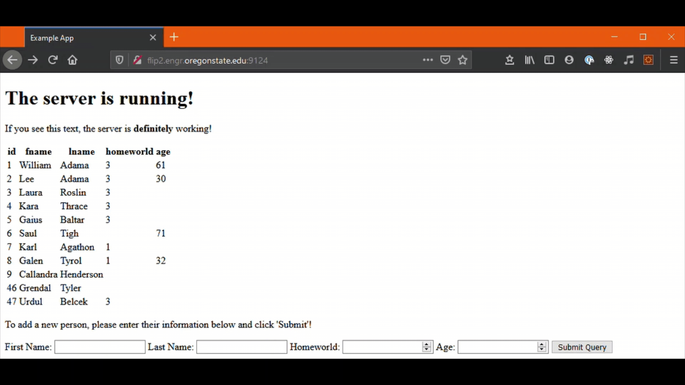
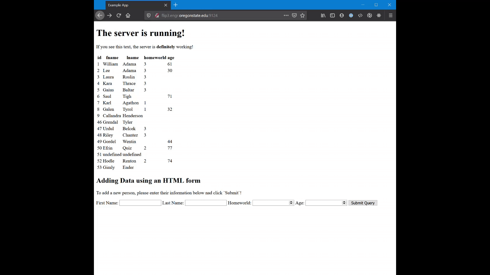

# Node.js - Step 5 - Adding New Data

At this point, we are able to effectively retrieve data from the database, and present it in a meaningful manner to the user of the application. We can now explore how to interact with that data.

## Staying Organized

Create a new folder in the root of your project called `public`. Inside of that new folder, create three new folders called `img`, `css`, `js`. These three folders will hold images we serve, style sheets we use, and scripts we implement, respectively, in our applicaiton. At this point, your project directory structure should look like this:

```
├─ app.js                         
├─ .gitignore (not required, but smart if you are using Git for version control)
├─ public
│   ├ img
│   ├ css
│   └ js
├─ views
│   ├ index.hbs
│   └ layouts
│      └ main.hbs
├─ node_modules  
└─ database
    ├ bsg_db.sql
    └ db-connector.js
```

We are doing this because the next step, depending on the path you take, will require some DOM manipulation.

## Template Literals


In both of the following methods, you will see weird notation you see like `${homeworld}` in our JS. This is a JavaScript convention called a **template literal**. Learn to love them. You simply encase your variable in brackets, precede it with a dollar sign and JS will automatically convert that variable to a string (if possible) replacing it inline. Do note, **any time you use template literals, the ENTIRE string must be surrounded with backticks**. If you surround your stiring with double, or single quotes, it will not work.

## Configuring Express to Handle JSON and Form Data - REQUIRED

We need to make two separate changes in our `app.js` regardless of the method we choose moving forward. The change will be in the SETUP section, directly after the line that says `var app = express();`:

```javascript
// app.js - SETUP section

app.use(express.json())
app.use(express.urlencoded({extended: true}))
app.use(express.static('public'))
```

We are simply enabling express to handle JSON data, as well as form data. Don't read too much into this part.

# Method 1 - Adding New Data via Asynchronous Javascript and XML (AJAX)

This method will require some Document Object Model (DOM) manipulation. This is something that is covered thoroughly in CS 290, so this guide assumes you have a handle on the basics.

## Modifying `index.hbs`

Open up `/views/index.hbs` in your favorite text editor. Then proceed to add an id to the people table, the id will be needed for locating our table with javascript later on in this step and in future project steps. The table should look something like the following:

```html

{{!-- Create a table --}}
<table id="people-table">

    {{!-- Header section --}}
    <thead>

        {{!-- For just the first row, we print each key of the row object as a header cell so we
        know what each column means when the page renders --}}
        <tr>
            {{#each data.[0]}}
            <th>
                {{@key}}
            </th>
            {{/each}}
        </tr>
    </thead>

    {{!-- Body section --}}
    <tbody>

        {{!-- For each row, print the id, fname, lname, homeworld and age, in order --}}
        {{#each data}}
        <tr>
            <td>{{this.id}}</td>
            <td>{{this.fname}}</td>
            <td>{{this.lname}}</td>
            <td>{{this.homeworld}}</td>
            <td>{{this.age}}</td>
        </tr>
        {{/each}}
    </tbody>
</table>
```

Afterwards, we need to create a few text boxes, and a button to submit the data to the database. When you are done, your `index.hbs` should look something like this:

```html
<!-- /views/index.hbs -->

{{!-- Form to add a record to the table  --}}
<h2>Adding Data with AJAX</h2>
<p>To add a new person, please enter their information below and click 'Submit'!</p>
<form id="add-person-form-ajax">
    <label for="input-fname">First Name: </label>
    <input type="text" name="input-fname" id="input-fname">
    
    <label for="input-lname">Last Name: </label>
    <input type="text" name="input-lname" id="input-lname">

    <label for="input-homeworld">Homeworld: </label>
    <input type="number" name="input-homeworld" id="input-homeworld">

    <label for="input-age">Age: </label>
    <input type="number" name="input-age" id="input-age">

    <input type="submit">
</form>

{{!-- Embed our javascript to handle the DOM manipulation and AJAX request --}}
<script src="./js/add_person.js"></script>
```

## Modify `app.js`

The first change will be to create a new route, but this one will be a POST route. So instead of `app.get()` we will use `app.post()`. Here's the example:

```javascript
// app.js - ROUTES section

app.post('/add-person-ajax', function(req, res) 
{
    // Capture the incoming data and parse it back to a JS object
    let data = req.body;

    // Capture NULL values
    let homeworld = parseInt(data.homeworld);
    if (isNaN(homeworld))
    {
        homeworld = 'NULL'
    }

    let age = parseInt(data.age);
    if (isNaN(age))
    {
        age = 'NULL'
    }

    // Create the query and run it on the database
    query1 = `INSERT INTO bsg_people (fname, lname, homeworld, age) VALUES ('${data.fname}', '${data.lname}', ${homeworld}, ${age})`;
    db.pool.query(query1, function(error, rows, fields){

        // Check to see if there was an error
        if (error) {

            // Log the error to the terminal so we know what went wrong, and send the visitor an HTTP response 400 indicating it was a bad request.
            console.log(error)
            res.sendStatus(400);
        }
        else
        {
            // If there was no error, perform a SELECT * on bsg_people
            query2 = `SELECT * FROM bsg_people;`;
            db.pool.query(query2, function(error, rows, fields){

                // If there was an error on the second query, send a 400
                if (error) {
                    
                    // Log the error to the terminal so we know what went wrong, and send the visitor an HTTP response 400 indicating it was a bad request.
                    console.log(error);
                    res.sendStatus(400);
                }
                // If all went well, send the results of the query back.
                else
                {
                    res.send(rows);
                }
            })
        }
    })
});
```

This is a big chunk of code; let's break it down into pieces.

- The `app.post('/add-person-ajax', function (req, res)...` indicates we set up a 'route' that will honor POST requests coming to `/add-person`. This will be the URI we use in the client side JavaScript.
- In POST requests, data transmitted is always contained in the body of the request. In express, you access that data using `req.body`.
- The `homeworld` and `age` are number values. If the fields are left blank and we try to parse them to integers, they'll become `NaN`. We test for this and assume if they were blank, they should be `NULL` in the database.

The rest is simply writing a string containing the query we want to run, followed by running the query. 

Once we run the `INSERT` query, we then will see if there was an error. If there was an error, we send back a status of 400, indicating it was a 'Bad Request'. The user is allowed to try again. If there was no error, we run the `SELECT` query, make sure there were no more errors, and if all went well, send back the results of the second query.

## Create `add_person.js` - Client-Side JS

Inside your `public/js` directory, create a file called `add_person.js`. Open it in a text editor.

Again, another massive wall of code. But, really its only long because there are 5 fields in the table, and 4 fields to read from for the form. Instead of using loops, I wrote out each line with clear variable names to make it super easy to understand what is actually going on here. Feel free to optimize in your own implementation.

```javascript
// Get the objects we need to modify
let addPersonForm = document.getElementById('add-person-form-ajax');

// Modify the objects we need
addPersonForm.addEventListener("submit", function (e) {
    
    // Prevent the form from submitting
    e.preventDefault();

    // Get form fields we need to get data from
    let inputFirstName = document.getElementById("input-fname");
    let inputLastName = document.getElementById("input-lname");
    let inputHomeworld = document.getElementById("input-homeworld");
    let inputAge = document.getElementById("input-age");

    // Get the values from the form fields
    let firstNameValue = inputFirstName.value;
    let lastNameValue = inputLastName.value;
    let homeworldValue = inputHomeworld.value;
    let ageValue = inputAge.value;

    // Put our data we want to send in a javascript object
    let data = {
        fname: firstNameValue,
        lname: lastNameValue,
        homeworld: homeworldValue,
        age: ageValue
    }
    
    // Setup our AJAX request
    var xhttp = new XMLHttpRequest();
    xhttp.open("POST", "/add-person-ajax", true);
    xhttp.setRequestHeader("Content-type", "application/json");

    // Tell our AJAX request how to resolve
    xhttp.onreadystatechange = () => {
        if (xhttp.readyState == 4 && xhttp.status == 200) {

            // Add the new data to the table
            addRowToTable(xhttp.response);

            // Clear the input fields for another transaction
            inputFirstName.value = '';
            inputLastName.value = '';
            inputHomeworld.value = '';
            inputAge.value = '';
        }
        else if (xhttp.readyState == 4 && xhttp.status != 200) {
            console.log("There was an error with the input.")
        }
    }

    // Send the request and wait for the response
    xhttp.send(JSON.stringify(data));

})


// Creates a single row from an Object representing a single record from 
// bsg_people
addRowToTable = (data) => {

    // Get a reference to the current table on the page and clear it out.
    let currentTable = document.getElementById("people-table");

    // Get the location where we should insert the new row (end of table)
    let newRowIndex = currentTable.rows.length;

    // Get a reference to the new row from the database query (last object)
    let parsedData = JSON.parse(data);
    let newRow = parsedData[parsedData.length - 1]

    // Create a row and 4 cells
    let row = document.createElement("TR");
    let idCell = document.createElement("TD");
    let firstNameCell = document.createElement("TD");
    let lastNameCell = document.createElement("TD");
    let homeworldCell = document.createElement("TD");
    let ageCell = document.createElement("TD");

    // Fill the cells with correct data
    idCell.innerText = newRow.id;
    firstNameCell.innerText = newRow.fname;
    lastNameCell.innerText = newRow.lname;
    homeworldCell.innerText = newRow.homeworld;
    ageCell.innerText = newRow.age;

    // Add the cells to the row 
    row.appendChild(idCell);
    row.appendChild(firstNameCell);
    row.appendChild(lastNameCell);
    row.appendChild(homeworldCell);
    row.appendChild(ageCell);
    
    // Add the row to the table
    currentTable.appendChild(row);
}
```

Breaking it down into pieces, here is what is going on:

1. We first tell the browser, don't submit the form in the conventional sense, so we call `preventDefault` on the submit event to do this.

2. We gather the input data from the form, package it into a single object called `data`.

3. Create the AJAX request, tell it we are sending JSON (header), tell it what we want to do when we get something back (`onreadystatechange`), and then send the data.

4. When the `readyState` becomes 4 it means we are done receiving, and we are looking for an HTTP Status Code of 200 which means 'OK'. If we get that, we add the row to the table in the DOM and clear the input fields, otherwise, we just print an error message to the console. 

5. The second function is the DOM manipulation part. It's nothing that hasn't been covered in 290, but it has just been separated out into its own function. Remember keep it neat and tidy! Since we get JSON back from Express, we do need to `JSON.parse()` it before accessing the Object's members, in this case it will be an array, containing an Object for each row returned from our `SELECT` query.

## Putting it All Together

Once all the files have been created or updated, restart your server and visit your page again. If all went well,
you should see the following behavior:



Note that the page **DOES NOT** reload when the 'Submit Query' button is pressed.

# Method 2 - Adding New Data via an HTML Form

This method achieves the same outcome, and for some purposes, is considered simpler, but requires the page to reload after each submission. There may be scenarios where you don't want the page to reload which is why you would use Method 1 instead. However, this behavior may be acceptable and as a result, this Method is acceptable.

## Modify `index.hbs`

The first thing we need to do is add the following lines to `index.hbs`:

```html
<!-- /views/index.hbs -->
<h2>Adding Data using an HTML form</h2>
<p>To add a new person, please enter their information below nad click `Submit`!</p>
<form id="add-person-form" method="POST" action="/add-person-form">
    <label for="input-fname">First Name: </label>
    <input type="text" name="input-fname" id="input-fname">
    
    <label for="input-lname">Last Name: </label>
    <input type="text" name="input-lname" id="input-lname">

    <label for="input-homeworld">Homeworld: </label>
    <input type="number" name="input-homeworld" id="input-homeworld">

    <label for="input-age">Age: </label>
    <input type="number" name="input-age" id="input-age">

    <input type="submit">
</form>
```

If you gave Method 2 a try, you'll notice that the form layout is *virtually* the same with 2 key differences: 

1. We specify a `method` in the opening `<form>` tag, in this example, we are using `POST`, which is idea for form data.

2. We specify an `action` in the opening `<form>` tag, in this example, we are using `/add-person-form`.

## Modify `app.js`

We need to add the following route to our `app.js` in the ROUTES section:

```javascript
// app.js

app.post('/add-person-form', function(req, res){
    // Capture the incoming data and parse it back to a JS object
    let data = req.body;

    // Capture NULL values
    let homeworld = parseInt(data['input-homeworld']);
    if (isNaN(homeworld))
    {
        homeworld = 'NULL'
    }

    let age = parseInt(data['input-age']);
    if (isNaN(age))
    {
        age = 'NULL'
    }

    // Create the query and run it on the database
    query1 = `INSERT INTO bsg_people (fname, lname, homeworld, age) VALUES ('${data['input-fname']}', '${data['input-lname']}', ${homeworld}, ${age})`;
    db.pool.query(query1, function(error, rows, fields){

        // Check to see if there was an error
        if (error) {

            // Log the error to the terminal so we know what went wrong, and send the visitor an HTTP response 400 indicating it was a bad request.
            console.log(error)
            res.sendStatus(400);
        }

        // If there was no error, we redirect back to our root route, which automatically runs the SELECT * FROM bsg_people and
        // presents it on the screen
        else
        {
            res.redirect('/');
        }
    })
})
```

This is a bigger chunk of code, so I'll mention the general flow here:

1. When the form's submit button is clicked, the data is sent to the back-end. Express will convert the received data into a JS object for us.

2. We access this data by accessing the `req.body` attribute. 

3. We then perform some minor validation on the received data, we assume that empty fields mean the user intended to assign the value NULL to that field.

4. Run the query, with the assistance of implementing **template literals**. 

5. We check to see if there was an error, if there was, we send an error HTTP code back to the client, if there was NO error, we use the call `res.redirect()` to redirect the client to the root route after a successful insert into the database.

## Putting it all together

Assuming you followed Method 2, you should get the following behavior from your web app (don't forget to restart the server!)



Note that everytime the `Submit Query` button is clicked, the entire page reloads.

# Summary

As you can see this step is significant, compared to previous steps. This also doesn't even factor in things like data validation, data sanitization, or unique cases. These are all things to consider when developing your project, and in particular become extremely important in industry.

