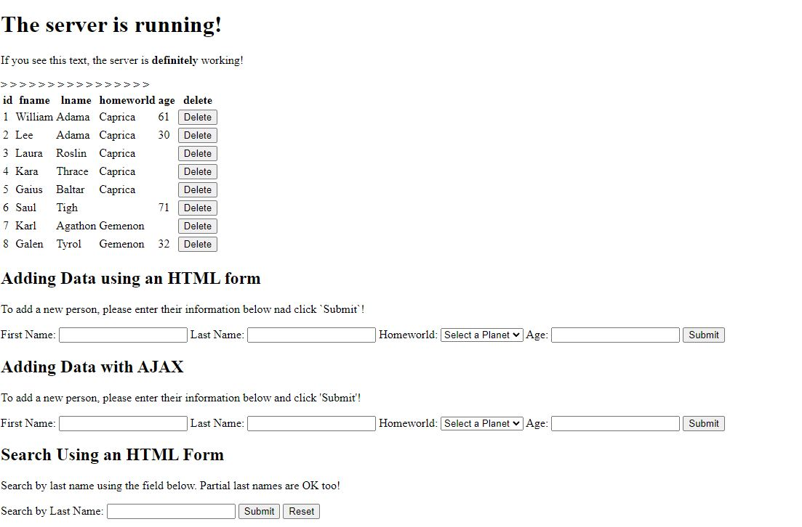

# Node.js - Step 7 - Dynamically Deleting Data

Up to this point the starter guide has covered how to create your very first server and how to grow that into an admin facing website that can dynamically display data from a database in a simple and organized manner.  The guide up to this point has also covered how to create new entries into the database via the front-end of the website. For project step 7 we will cover how to implement a delete function with two alternative methods one involving jQuery and the other involving regular javascript.

## Update the Handlebars template

The first step to implementing Delete is to create a delete button in our index.hbs file.  With your index.hbs open in your IDE of choice change your people-table to look like the following:

```html
<table id="people-table">>
    {{!-- Header section --}}
    <thead>

        {{!-- For just the first row, we print each key of the row object as a header cell so we
        know what each column means when the page renders --}}
        <tr>
            {{#each data.[0]}}
            <th>
                {{@key}}
            </th>
            {{/each}}
            <th>delete</th>
        </tr>
    </thead>

    {{!-- Body section --}}
    <tbody>

        {{!-- For each row, print the id, fname, lname, homeworld and age, in order --}}
        {{#each data}}
        <tr data-value={{this.id}}>>
            <td>{{this.id}}</td>
            <td>{{this.fname}}</td>
            <td>{{this.lname}}</td>
            <td>{{this.homeworld}}</td>
            <td>{{this.age}}</td>
            <td><button onclick="deletePerson({{this.id}})">Delete</button></td>
        </tr>
        {{/each}}
    </tbody>
</table>
<script src="./js/delete_person.js"></script>
```

The Delete will be implemented as a button on the right side of the table for ease of use.  This button will have an attached function that will be called on click to handle making the delete request.  There is also placement of a data-value on the table row for ease of use when finding the row to delete afterward.

## Part A) Using jQuery to send a delete request
If you want to try and use jQuery make sure to add the following line of code near the top of your index.hbs file.

```html
<script src="http://ajax.googleapis.com/ajax/libs/jquery/1.9.1/jquery.min.js"></script>
```

The script source will be needed for using jQuery and should be near the top of the handlebars file.

## Create a new Javascript file

Now we have to create a new file within our js subfolder titled delete_person.js

Next, open up the newly created delete_person.js file and paste the following lines of code.

```javascript
function deletePerson(personID) {
  let link = '/delete-person-ajax/';
  let data = {
    id: personID
  };

  $.ajax({
    url: link,
    type: 'DELETE',
    data: JSON.stringify(data),
    contentType: "application/json; charset=utf-8",
    success: function(result) {
      deleteRow(personID);
    }
  });
}

function deleteRow(personID){
    let table = document.getElementById("people-table");
    for (let i = 0, row; row = table.rows[i]; i++) {
       if (table.rows[i].getAttribute("data-value") == personID) {
            table.deleteRow(i);
            break;
       }
    }
}
```
The deletePerson function is called on button click and will handle passing along the personID of the person in the delete request. Afterwards, it will call on the deleteRow function to lookup the table row which matches the same data-value of the personID so it can delete that row.

End of Part A)

## Part B) Using regular javascript to send a delete request

With delete_person.js open in our js subfolder place the following lines of code

```javascript
function deletePerson(personID) {
    // Put our data we want to send in a javascript object
    let data = {
        id: personID
    };

    // Setup our AJAX request
    var xhttp = new XMLHttpRequest();
    xhttp.open("DELETE", "/delete-person-ajax", true);
    xhttp.setRequestHeader("Content-type", "application/json");

    // Tell our AJAX request how to resolve
    xhttp.onreadystatechange = () => {
        if (xhttp.readyState == 4 && xhttp.status == 204) {

            // Add the new data to the table
            deleteRow(personID);

        }
        else if (xhttp.readyState == 4 && xhttp.status != 204) {
            console.log("There was an error with the input.")
        }
    }
    // Send the request and wait for the response
    xhttp.send(JSON.stringify(data));
}


function deleteRow(personID){

    var table = document.getElementById("people-table");
    for (var i = 0, row; row = table.rows[i]; i++) {
       //iterate through rows
       //rows would be accessed using the "row" variable assigned in the for loop
       if (table.rows[i].getAttribute("data-value") == personID) {
            table.deleteRow(i);
            break;
       }
    }
}
```

End of Part B)

## Create a delete route

Finally, we need to update our app.js backend to support the delete route for people. To do so start by creating the following in your app.js file

```javascript
app.delete('/delete-person-ajax/', function(req,res,next){
  let data = req.body;
  let personID = parseInt(data.id);
  let deleteBsg_Cert_People = `DELETE FROM bsg_cert_people WHERE pid = ?`;
  let deleteBsg_People= `DELETE FROM bsg_people WHERE id = ?`;


        // Run the 1st query
        db.pool.query(deleteBsg_Cert_People, [personID], function(error, rows, fields){
            if (error) {

            // Log the error to the terminal so we know what went wrong, and send the visitor an HTTP response 400 indicating it was a bad request.
            console.log(error);
            res.sendStatus(400);
            }

            else
            {
                // Run the second query
                db.pool.query(deleteBsg_People, [personID], function(error, rows, fields) {

                    if (error) {
                        console.log(error);
                        res.sendStatus(400);
                    } else {
                        res.sendStatus(204);
                    }
                })
            }
})});
```

It is possible that a person can have their id in two different tables since they can exist within their native table bsg_people and the intersection table bsg_cert_people.  To handle this we first remove them from the intersection table by using the query on line 92, then we remove them from their native table bsg_people with the query on line 93.

Since every http communication has a request and response its important to send back a response even if the front-end doesn't need any data.  A lack of a response from the back-end will cause the front-end to hang and wait for a response.  Since we are just deleting 1 row and don't need to send back any new data we will send back a status of 204 (No Content) common for PUT or DELETE.

Notes: HTML forms only support POST and GET which means a form for updating or deleting won't work for app.put and app.delete routes respectively. It is also important to always include error handlers after performing queries so that if an error occurs the proper status can be displayed.


## Update add_person.js

Now its important to update our previous javascript file add_person.js so that when new rows are added through ajax they get a delete column with a working delete button since as of now new rows added won't get their proper delete button unless the page is refreshed.

Modify your addRowToTable function in add_person.js to include a new table data cell and button like the following code:

```javascript
// Creates a single row from an Object representing a single record from
// bsg_people
addRowToTable = (data) => {

    // Get a reference to the current table on the page and clear it out.
    let currentTable = document.getElementById("people-table");

    // Get the location where we should insert the new row (end of table)
    let newRowIndex = currentTable.rows.length;

    // Get a reference to the new row from the database query (last object)
    let parsedData = JSON.parse(data);
    let newRow = parsedData[parsedData.length - 1]

    // Create a row and 4 cells
    let row = document.createElement("TR");
    let idCell = document.createElement("TD");
    let firstNameCell = document.createElement("TD");
    let lastNameCell = document.createElement("TD");
    let homeworldCell = document.createElement("TD");
    let ageCell = document.createElement("TD");

    let deleteCell = document.createElement("TD");

    // Fill the cells with correct data
    idCell.innerText = newRow.id;
    firstNameCell.innerText = newRow.fname;
    lastNameCell.innerText = newRow.lname;
    homeworldCell.innerText = newRow.homeworld;
    ageCell.innerText = newRow.age;

    deleteCell = document.createElement("button");
    deleteCell.innerHTML = "Delete";
    deleteCell.onclick = function(){
        deletePerson(newRow.id);
    };


    // Add the cells to the row
    row.appendChild(idCell);
    row.appendChild(firstNameCell);
    row.appendChild(lastNameCell);
    row.appendChild(homeworldCell);
    row.appendChild(ageCell);
    row.appendChild(deleteCell);

    // Add a row attribute so the deleteRow function can find a newly added row
    row.setAttribute('data-value', newRow.id);

    // Add the row to the table
    currentTable.appendChild(row);
}
```

Now you should be able to delete rows due to the changes we made to the handlebars file and you should be able to delete new rows created through ajax request without having to refresh the page.  The final result should look like the following.


