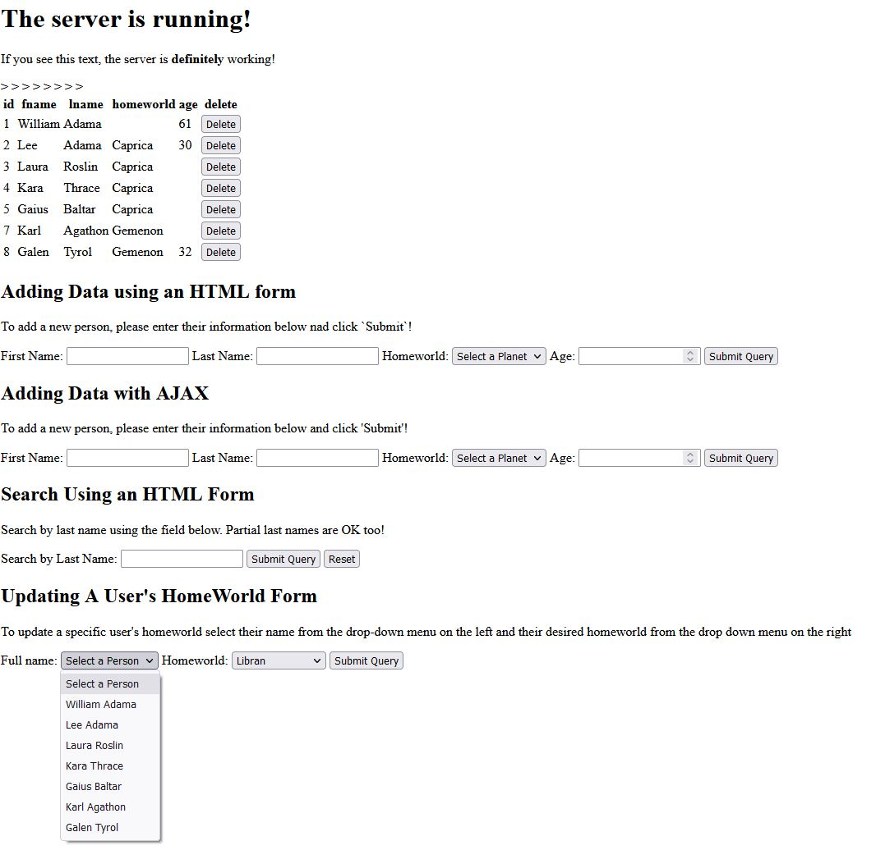

# Node.js - Step 8 - Dynamically Updating Data

So far, this guide has walked you through how to approach implementing reading, adding, and deleting data from a database via an admin facing website. The previous steps covered were representative of the C, R, and D in CRUD, but there is one last principle we have yet to implement which is U. The letter U in CRUD is representative of update. Step 8 of the guide will help walk you through dynamically implementing update with a drop-down menu. At the end of this step, you will have a few changes to implement on your own to really make the update feature feel fluid.

## Update the Handlebars template

The first step to implementing Update is to create a update form in our index.hbs file.  With your index.hbs open in your IDE of choice add the following lines of code towards the bottom of the file:

```html
<h2>Updating A User's HomeWorld Form</h2>
<p>To update a specific user's homeworld select their name from the drop-down menu on the left and their desired homeworld from the drop down menu on the right</p>
<form id="update-person-form-ajax">

    <label for="input-fullname">Full name: </label>
    <select name="input-fullname" id="mySelect">
        <option value="test">Select a Person</option>
        {{#each data}}
        <option value="{{this.id}}">{{this.fname}} {{this.lname}}</option>
        {{/each}}
    </select>

    <label for="input-homeworld">Homeworld: </label>
    <select name="input-homeworld" id="input-homeworld-update">
        <option>Select a Planet</option>
        {{#each planets}}
        <option value="{{this.id}}">{{this.name}}</option>
        {{/each}}
    </select>
    <input type="submit">

</form>

<script src="./js/update_person.js"></script>
```

The Update feature will be similar to the add person form via ajax.

Also, while we are here the script tag is placed at the bottom AFTER the form for good reason. If we were to place the script tag for update_person.js before the update form, we would have issues with a null object when trying to get the form and add a listener (due to JavaScript loading before form in that instance). So, make sure you keep the script tag after the form like in the example code above.

The script tag will help us locate our update_person.js file we will create in the next step.

## Create a new Javascript file

Now we have to create a new file within our js sub-folder titled update_person.js

Next, open up the newly created update_person.js file and paste the following lines of code.

```javascript

// Get the objects we need to modify
let updatePersonForm = document.getElementById('update-person-form-ajax');

// Modify the objects we need
updatePersonForm.addEventListener("submit", function (e) {
   
    // Prevent the form from submitting
    e.preventDefault();

    // Get form fields we need to get data from
    let inputFullName = document.getElementById("mySelect");
    let inputHomeworld = document.getElementById("input-homeworld-update");

    // Get the values from the form fields
    let fullNameValue = inputFullName.value;
    let homeworldValue = inputHomeworld.value;
    
    // currently the database table for bsg_people does not allow updating values to NULL
    // so we must abort if being bassed NULL for homeworld

    if (isNaN(homeworldValue)) 
    {
        return;
    }


    // Put our data we want to send in a javascript object
    let data = {
        fullname: fullNameValue,
        homeworld: homeworldValue,
    }
    
    // Setup our AJAX request
    var xhttp = new XMLHttpRequest();
    xhttp.open("PUT", "/put-person-ajax", true);
    xhttp.setRequestHeader("Content-type", "application/json");

    // Tell our AJAX request how to resolve
    xhttp.onreadystatechange = () => {
        if (xhttp.readyState == 4 && xhttp.status == 200) {

            // Add the new data to the table
            updateRow(xhttp.response, fullNameValue);

        }
        else if (xhttp.readyState == 4 && xhttp.status != 200) {
            console.log("There was an error with the input.")
        }
    }

    // Send the request and wait for the response
    xhttp.send(JSON.stringify(data));

})


function updateRow(data, personID){
    let parsedData = JSON.parse(data);
    
    let table = document.getElementById("people-table");

    for (let i = 0, row; row = table.rows[i]; i++) {
       //iterate through rows
       //rows would be accessed using the "row" variable assigned in the for loop
       if (table.rows[i].getAttribute("data-value") == personID) {

            // Get the location of the row where we found the matching person ID
            let updateRowIndex = table.getElementsByTagName("tr")[i];

            // Get td of homeworld value
            let td = updateRowIndex.getElementsByTagName("td")[3];

            // Reassign homeworld to our value we updated to
            td.innerHTML = parsedData[0].name; 
       }
    }
}

```

There may be some familiar and some new features here. First off before sending the PUT request for update we check that the user clicked a value for homeworld that isn't null. The check for null is needed because of how the sql for the bsg_people table is setup we can't update values for home world to NULL. This check prevents accidentally causing a sql error in the backend query.

Another familiar feature is that we are iterating through the tr in the people table to find the one that matches our personID of the person we just updated and once we find that we are indexing into the table and getting the TD for home world so we can finally update the text to the new planet's name.


One important last step before we move on to the back-end side of things. Open up the add_person.js file in the same directory and make some changes to the addRowToTable function like the following.

```javascript
addRowToTable = (data) => {

    // Get a reference to the current table on the page and clear it out.
    let currentTable = document.getElementById("people-table");

    // Get the location where we should insert the new row (end of table)
    let newRowIndex = currentTable.rows.length;

    // Get a reference to the new row from the database query (last object)
    let parsedData = JSON.parse(data);
    let newRow = parsedData[parsedData.length - 1]

    // Create a row and 4 cells
    let row = document.createElement("TR");
    let idCell = document.createElement("TD");
    let firstNameCell = document.createElement("TD");
    let lastNameCell = document.createElement("TD");
    let homeworldCell = document.createElement("TD");
    let ageCell = document.createElement("TD");

    let deleteCell = document.createElement("TD");

    // Fill the cells with correct data
    idCell.innerText = newRow.id;
    firstNameCell.innerText = newRow.fname;
    lastNameCell.innerText = newRow.lname;
    homeworldCell.innerText = newRow.homeworld;
    ageCell.innerText = newRow.age;

    deleteCell = document.createElement("button");
    deleteCell.innerHTML = "Delete";
    deleteCell.onclick = function(){
        deletePerson(newRow.id);
    };

    // Add the cells to the row 
    row.appendChild(idCell);
    row.appendChild(firstNameCell);
    row.appendChild(lastNameCell);
    row.appendChild(homeworldCell);
    row.appendChild(ageCell);
    row.appendChild(deleteCell);
    
    // Add a custom row attribute so the deleteRow function can find a newly added row
    row.setAttribute('data-value', newRow.id);

    // Add the row to the table
    currentTable.appendChild(row);

    // Start of new Step 8 code for adding new data to the dropdown menu for updating people
    
    // Find drop down menu, create a new option, fill data in the option (full name, id),
    // then append option to drop down menu so newly created rows via ajax will be found in it without needing a refresh
    let selectMenu = document.getElementById("mySelect");
    let option = document.createElement("option");
    option.text = newRow.fname + ' ' +  newRow.lname;
    option.value = newRow.id;
    selectMenu.add(option);
    // End of new step 8 code.
}
```
There are a few new changes presented here, the first of which is to add a custom attribute to the newly created row (if not added from previous step 7). The addition of the custom attribute is so that when we create new rows via ajax, we can then immediately find them when we must search for them when updating or deleting rows. So now, when a user creates a new person row via ajax, they can immediately update that person's home world without having to refresh the page at all. The next set of changes is to basically add the newly created persons data to the drop-down menu so that we can have their info immediately reflected in the update drop down menu without having to refresh the page.

## Update the back-end (app.js)

Now our final step is to update our back-end route so that we can handle updating and returning data back that is needed for update_person.js. To begin add the following lines of code to your app.js file.


```javascript
app.put('/put-person-ajax', function(req,res,next){
  let data = req.body;

  let homeworld = parseInt(data.homeworld);
  let person = parseInt(data.fullname);

  let queryUpdateWorld = `UPDATE bsg_people SET homeworld = ? WHERE bsg_people.id = ?`;
  let selectWorld = `SELECT * FROM bsg_planets WHERE id = ?`

        // Run the 1st query
        db.pool.query(queryUpdateWorld, [homeworld, person], function(error, rows, fields){
            if (error) {

            // Log the error to the terminal so we know what went wrong, and send the visitor an HTTP response 400 indicating it was a bad request.
            console.log(error);
            res.sendStatus(400);
            }

            // If there was no error, we run our second query and return that data so we can use it to update the people's
            // table on the front-end
            else
            {
                // Run the second query
                db.pool.query(selectWorld, [homeworld], function(error, rows, fields) {

                    if (error) {
                        console.log(error);
                        res.sendStatus(400);
                    } else {
                        res.send(rows);
                    }
                })
            }
})});
```

Notice our route starts with .put since we are updating information via a put request. Also, we use two different queries here the first of which is an UPDATE query to set the home world for a specific person to a new value, and the second query which is to just get data about that very same planet so we can return that information to the front-end to later use for updating the people table row for this very same person.

Notes: HTML forms only support POST and GET which means a form for updating or deleting won't work for app.put and app.delete routes respectively. It is also important to always include error handlers after performing queries so that if an error occurs the proper status can be displayed.


Now you should be able to update rows due to the changes we made to the handlebars file and you should be able to update new rows created through ajax request without having to refresh the page.  The final result should look like the following.



## One last task!

In this step we covered how to dynamically add newly created people to the update drop down menu via the changes reflected in the add_person.js file, however we did not cover how to dynamically delete person data from the drop-down menu when we delete them which means people will be left in the drop-down menu after deletion till the page is refreshed (try it now to see!).

See if you can hack it yourself so that the drop-down menu can be updated dynamically in the opposite way this step covered. Good luck

## See below for code to dynamically remove people from the drop down menu

Add a function call to deleteDropDownMenu from deleteRow after it finds the correct row to delete like the following:

```javascript

function deleteRow(personID){

    let table = document.getElementById("people-table");
    for (let i = 0, row; row = table.rows[i]; i++) {
       //iterate through rows
       //rows would be accessed using the "row" variable assigned in the for loop
       if (table.rows[i].getAttribute("data-value") == personID) {
            table.deleteRow(i);
            deleteDropDownMenu(personID);
            break;
       }
    }
}


function deleteDropDownMenu(personID){
  let selectMenu = document.getElementById("mySelect");
  for (let i = 0; i < selectMenu.length; i++){
    if (Number(selectMenu.options[i].value) === Number(personID)){
      selectMenu[i].remove();
      break;
    } 

  }
}

```

